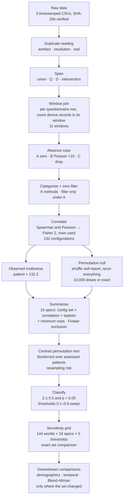

# AAMOS-00 concordance analysis, v2

Revision of *Characterization of Concordant Users of Smart Inhalers in Asthma* after the JMIR review.
Everything below runs from this repo on a laptop (all 144 worlds in about 80 minutes); no cloud compute.

**Headline.** Under the revised primary definition the concordant users are **190, 702 and 917**.
Under the complete-case variant they are **294, 473 and 702** in every span and duplicate reading. Under Poisson
imputation nobody is concordant in all ten imputations, although 294, 473 and 702 stay significant in every one.

> [!IMPORTANT]
> **Three participants (514, 917, 939) use Fostair, which the protocol lists as a relief inhaler, i.e. they are on
> maintenance-and-reliever therapy (MART).** Their device logs maintenance puffs as well as as-needed ones, and 939's
> answers suggest the relief question was read as "as-needed only". 917 is one of the three concordant users.
> See [§5](#5-fostair-participants-514-917-939) and question 7 for Kevin.

---

## 1. New terms

The v1 analysis was one pipeline with one set of choices. v2 turns the choices that the reviewer and Kevin
questioned into explicit axes and runs every combination. These are the words used for that.

| Term | Meaning |
|---|---|
| **World** | One complete run of the pipeline under one *span*, one *absence case* and one *duplicate reading*. Named `span=<span>__case=<case>[__dup=<reading>]`. The v1 analysis is (up to the corrections in §4) `span=union__case=A`. **144 worlds** were run: 4 spans × 12 cases (A, B×10, C) × 3 readings. |
| **Span** | The per-patient date interval inside which raw entries are believed. Entries outside it are removed from *both* sources before anything else happens. |
| · `union` | first entry of either source to last entry of either. Trims nothing. **This is v1.** |
| · `Q` | first to last questionnaire entry. |
| · `D` | first to last device record. Kevin's "more confident of true zero" variant (KT13). |
| · `intersection` | the overlap of Q and D. |
| **Absence case** | What a questionnaire window with **no device records** is taken to mean (reviewer point 4). |
| · `A` | zero puffs. **This is v1.** |
| · `B` | a device-side miss: replace the zero with a draw from Poisson(patient's puff rate × window hours). Ten draws give ten worlds (`k=00…09`). |
| · `C` | unknown: drop the window from that configuration. Complete case. |
| **Duplicate reading** *(new)* | 490 of 2,863 device rows repeat another row exactly (same day, time, medication). Whether a repeat is a second puff or a sync artefact can't be told from the data, so there are three readings: |
| · `artefact` | drop every repeat. **Primary**, and what v1's observed analysis did (omitted from the world name). |
| · `resolution` | keep repeats at `:00` seconds (records at minute resolution, where two puffs in one minute collapse); drop repeats to the second. |
| · `real` | keep every row. |
| **Configuration** | One of the 132 combinations of window (11), categorisation method (6) and zero filter (on/off) from the paper. Unchanged. |
| **Look-ahead window** *(new)* | Two of the 11 windows reach past the answer: the fixed 24 h chunk starting 12 h before it (it ends 12 h after) and calendar day 0 (the whole day of the answer). The question asks about *"the past 24 hours"*. |
| **Effective configurations** | Spearman uses ranks, so methods that rank values identically are one analysis. The 132 configurations are **80 distinct analyses** under Spearman (4 method classes × 10 distinct windows × 2 filter settings), **64 without the look-ahead windows**. Under B and C the filter is off, which halves both. |
| **Summary spec** | How per-configuration Z values become one number per patient: configuration set (`all` = 132, `effective` = 64, `effective_lookahead` = 80), correlation (Spearman/Pearson), statistic (mean/median), **minimum rows** per configuration, and **patient exclusion**. **Primary = effective / Spearman / mean, minimum 3 rows, nobody excluded.** |
| **Minimum rows** *(new)* | A configuration counts only if its correlation used at least that many rows, in the observed data and in every permutation. Grid: 3 (v1; smallest n with a defined correlation), 5 (smallest n at which ρ can reach p < .05), 20 (a correlation at the threshold, Z = 0.5, is itself significant), 37 (80 % power for it). |
| **Centred test** | The permutation p-value counts null draws at least as far from the **null's own mean** as the observed value is. v1 counted draws at least as far from **zero**. See §3. |
| **Exact enumeration** | For patients with few questionnaire rows, all distinct arrangements of the self-report are enumerated instead of sampled: 328 (136), 454 (840), 917 (2,520), 398 (12,650). No Monte Carlo error for those four. |
| **Resampling risk** | For sampled patients, the probability that the Bonferroni decision would differ under the exact p-value; plus how many permutations a risk-bounded sequential rule (Gandy 2009) would have needed. |
| **Concordant** | Unchanged: observed Z ≥ 0.5 **and** Bonferroni-corrected p < 0.05 (α = 0.05/15). |

---

## 2. Pipeline



The observed data and the null go through the **same** boxes, so they always see the same rows (v1's did not; §4).
Stages up to **Correlate** are v1's code refactored into one package and pinned to verbatim copies of the v1
implementation (with v1's definitions switched on) by 641 tests. Everything from **Summarise** on is post-processing
over stored per-configuration values and recomputes in seconds.

| Stage | Assumptions worth knowing |
|---|---|
| Window join | Left join: rows come only from questionnaires. Device records on days with no questionnaire never enter a correlation (§6.6 counts them). Missing questionnaires are **excluded**, not zero (the v1 Methods text said zero; the code never did that). All windows are closed at both ends. |
| Absence case | A patient whose span cannot be formed (e.g. no device records under `D`) drops out of that world. |
| Categorise | Self-report codes {0, 1, 3, 5, 9, 12} are **bands**: none, 1–2, 3–4, 5–8, 9–12, **12 or more** (data dictionary). Code 12 goes to Table 2's top band (">12", or M/N for the data-driven methods). v1 put it in 9–12. |
| Correlate | A perfect correlation (\|r\| = 1) is invalid and excluded, as v1 intended. |
| Permutation null | Shuffling reproduces v1's random draws index by index (same seed). |
| Classify | The threshold is on the raw observed Z, not on distance from the null (open question 2). |

---

## 3. Why the null is not centred on zero

The zero filter drops rows where both signals are zero. After shuffling, a zero self-report that survives is
always paired with a positive device count, which manufactures a *negative* correlation. Null means reach
−0.66 (343), −0.54 (702), −0.51 (190). Under case C the mutual zeros are gone and the null sits at 0 for
everyone, which confirms the mechanism.

v1 asked "is |observed| larger than |null|", which mixes distance from the null with the null's own offset:
patient 190 sat 5 SD above its null yet had p = 0.77. The v1 figure already drew the band around the null's
centre; the code now tests the same way.

---

## 4. What changed from v1

| Change | Why | Effect |
|---|---|---|
| Centred permutation test | §3 | 190, 343, 917 become Bonferroni-significant under the v1 configuration set |
| Ties count as exceedances | an exact patient's p must not depend on rounding | ≤ 1/(n+1) per patient |
| Perfect correlations excluded | scipy sometimes returns 1 − 1 ulp; v1 recorded Z ≈ 18 for 7,850 permutations | null means for 398 and 328 were distorted |
| **Duplicate rows treated alike in observed and null** | v1 dropped them from the observed data but its Cloud Run null kept them | 917's p was 0.012 against the mismatched null; 0.048 against the matched one |
| **Code 12 = "12 or more"**, top band | the questionnaire's top option is a band, not a count | 4 answers (113, 473). Makes the upper-bound hybrid its own Spearman class: 80 effective configurations, not 60 |
| Summary over effective configurations | the mean over 132 counted identical methods several times | 294 and 473 fall from 0.52 / 0.53 to 0.48 / 0.47 |
| **Look-ahead windows out of the primary set** | the question asks about the past 24 hours; those two windows count 42–49 % of their records after the answer | 190 rises from 0.35 to 0.52 and joins; 294 and 473 move to 0.47 / 0.45. Kept as a sensitivity |
| Fixed chunks closed at the end (`≤`) | consistency with the other windows | none on this data |
| Exact enumeration for small n | §1 | no Monte Carlo error for 4 patients |
| Vectorised engine | the join does not depend on the shuffle, so it is computed once | ~2 min per world locally |

---

## 5. Fostair participants (514, 917, 939)

The protocol lists Fostair among eligible relief inhalers, so these three use it as **maintenance and reliever
therapy** (MART). The smart inhaler then logs maintenance doses too, while the daily question is *"How many puffs of
your relief inhaler ("blue puffer") did you have in the past 24 hours?"*.

| patient | answers | device logged ≥ 3 puffs in the 24 h before the answer | … and the answer was **0** |
|---|---|---|---|
| **939** | 158 | 111 | **40** (36 %) |
| 917 | 9 | 4 | 0 |
| 514 | 54 | 0 | 0 |
| *294 (Ventolin), for comparison* | *173* | *146* | *0* |
| *473 (Ventolin)* | *69* | *21* | *1* |

939 answers "none" on a third of the days on which the device logged three or more puffs, which fits counting
as-needed puffs only. 939 also reports using two relief inhalers.

**Sensitivity.** Excluding the three (Bonferroni over 12) gives **190, 702** at the baseline: 917 leaves by
exclusion and nobody else changes status.

---

## 6. Results

Assessed patients (15): 113, 190, 294, 328, 343, 398, 447, 454, 473, 514, 625, 701, 702, 917, 939.

### 6.1 Baseline world (`union`, case A, artefact), primary spec

| patient | Z (64 configs) | null mean | distance (null SD) | p Bonf | concordant |
|---|---|---|---|---|---|
| 917 | 0.96 | −0.19 | 3.4 | 0.048 (exact) | **yes**, borderline |
| 702 | 0.78 | −0.54 | 10.8 | 0.001 | **yes** |
| 190 | 0.52 | −0.51 | 6.2 | 0.001 | **yes** |
| 294 | 0.47 | −0.01 | 10.4 | 0.001 | no, Z < 0.5 |
| 473 | 0.45 | −0.12 | 6.8 | 0.001 | no, Z < 0.5 |
| 343 | −0.15 | −0.66 | 4.4 | 0.001 | no, Z < 0.5 |

Nine of 15 are Bonferroni-significant; the Z threshold does the selecting.

### 6.2 Sensitivity grid, primary spec, threshold 0.5

| | A (zero) | B (Poisson; concordant in k of 10) | C (drop) |
|---|---|---|---|
| union, artefact (baseline) | 190, 702, 917 | – (398: 5/10, 702: 5/10) | 294, 473, 702 |
| D, artefact | 190, 702, 917 | – (702: 6/10, 398: 5/10) | 294, 473, 702 |
| Q or intersection, artefact | 190, 702 | – (702: 1–2/10) | 294, 473, 702 |
| any span, `real` or `resolution` | 190, 702 | – (at most 5/10) | 294, 473, 702 |

- **Only three sets occur in 144 worlds.** The absence case dominates; span and duplicate reading only decide 917.
- **917** leaves under Q and intersection (the device day before its first questionnaire is trimmed: Z 0.69,
  p 0.20) and when its 39 repeated rows are kept (Z 0.70, p 0.19). It is never concordant under B or C.
- **C:** null centred at 0; 294 (0.52), 473 (0.52) and 702 (0.68) clear the threshold in all 12 C worlds.
- **B:** 294, 473 and 702 are significant in **10 of 10** imputations on every span; the imputed counts pull their Z
  just under 0.5. B moves the threshold, not the evidence of association.

### 6.3 One-at-a-time sensitivities (baseline world)

| spec | concordant |
|---|---|
| **primary** | **190, 702, 917** |
| look-ahead windows kept | 702, 917 |
| minimum 5 rows | 190, 702, 917 |
| minimum 20 rows | 190, 398, 702 (917 has 9 rows) |
| minimum 37 rows | 190, 702 |
| Fostair excluded | 190, 702 |
| v1 configuration set (all 132) | 294, 473, 702, 917 |

**702 is concordant in every A and C world and under every spec above.**

### 6.4 Threshold sweep (baseline, primary spec)

| threshold | 0.1 | 0.25 | 0.5 | 0.75 | 0.9 |
|---|---|---|---|---|---|
| concordant | 8 patients | 8 | 190, 702, 917 | 702, 917 | 917 |

### 6.5 Permutation count (KT1, KT2)

A Bonferroni decision at α = 0.0033 cannot be reached below ~300 draws. Every concordance call in every A and C
world settles by **2,400** draws under the sequential rule, and in all 144 worlds no concordance call carries
resampling risk above 10⁻⁶. Borderline significance decisions occur only for patients below the Z threshold
(343, 113, 447 in some worlds).

### 6.6 Missingness diagnostics (reviewer point 4, KT14)

- **Non-response is not hiding heavy use.** Device use is *lower* on days without a questionnaire for 14 of 15
  patients (significant for 4); non-response comes in blocks for 9 of 15. Median non-response rate 23 %.
- **Device-only days**, which never enter a correlation: 473 has 40 days / 99 puffs; 917 20 / 64; 939 24 / 70.
- **Mutual zeros** dominate 190, 343 and 702. This is what the zero filter acts on and why those nulls sit far below zero.
- **Duplicates** (`diagnostics/duplicates.csv`): 316 of the 490 repeats are at minute resolution; 155 of the 174
  repeats to the second belong to 939.

---

## 7. Paper updates

| # | Section | Change |
|---|---|---|
| 1 | Methods, multiverse | "132 configurations" → 132 specified, **80 distinct** under Spearman, **64** in the primary set (look-ahead windows excluded, with the reason). Table 2: keep the ">12" column; it is the questionnaire's "12 or more" answer |
| 2 | Methods, missing data | Missing questionnaires are excluded, not zero. Duplicate device rows: three readings, the primary drops them. Report §6.6 |
| 3 | Methods, participants | Fostair = MART for 514, 917, 939; how the relief question interacts with it; exclusion sensitivity (§5) |
| 4 | Methods, test | Centred two-tailed test; null mean and distance per patient; exact enumeration for 4 patients; sequential stopping at 2,400 |
| 5 | Methods, definition | One sentence: mean Z over the 64 effective configurations ≥ 0.5 and Bonferroni p < 0.05; span union, absence case A, duplicates dropped |
| 6 | Results | Headline 190, 702, 917; grid (§6.2); one-at-a-time table (§6.3); threshold table (§6.4); B as k of 10 |
| 7 | Sensitivity | Move into Methods and Results; it is the main analysis |
| 8 | Discussion | Exploratory framing; 702 is the only user concordant everywhere outside B; drop causal wording on Clinical Care Value |
| 9 | Housekeeping | Fill the XX placeholders; hybrid thresholds are per patient; remove unused Pearson outputs |

## 8. Reviewer replies, one line each

| Point | Reply |
|---|---|
| R1 small sample | Agreed; exploratory framing; headline set is 3 of 15, and one user (702) is stable across every A and C world |
| R2 too many analyses | Multiverse reduced to its distinct configurations; clustering and embedding classifier cut; grid reported as marginals |
| R3 arbitrary threshold | Swept 0.1–0.9 (§6.4); mean and median; minimum-rows grid with stated bases (§6.3) |
| R4 absence = zero | Three absence cases × four spans × three duplicate readings (§6.2); non-response examined directly (§6.6) |
| R5 causality | Wording removed |
| R6 definition ambiguous | One sentence with every choice named (§7, row 5) |
| R7 sensitivity is post hoc | It is now the analysis (§7, row 7) |

Kevin's comments: KT1/2 → §6.5; KT3 → zero filter off under B and C; KT5 → §7 row 2; KT8 → implemented;
KT11/13 → span axis; KT14 → §6.6; KT16 → exact set comparison in the grid.

---

## 9. Reproduce

```bash
python -m aamos_concordance --verify                              # raw data matches the manifest
python scripts/build_world.py --world span=union__case=A          # one world, ~2 min
python scripts/build_world.py --all --skip-current --shard 0/4    # all 144 worlds: run shards 0/4 … 3/4 in parallel
python scripts/sensitivity_grid.py                                 # grid and marginals over built worlds
python scripts/missingness_diagnostics.py                          # §6.6
python run_all.py --changed-worlds --skip-sentiment                # downstream comparisons where the set changed
```

Run the tests one file at a time (`python -m pytest -q tests/test_<name>.py`); the largest take about 3 minutes.

## 10. Where things are

| Path | Contents |
|---|---|
| `aamos_concordance/` | the pipeline: `definitions`, `duplicates`, `spans`, `join`, `categorization`, `engine`, `summary`, `sensitivity`, `resampling` |
| `results/v1/` | frozen published results |
| `results/v2/worlds/<world>/` | `per_config_z.csv` (observed), `summary.csv`, `observed.csv`, `threshold_sweep.csv` |
| `results/v2/sensitivity/` | `grid.csv`, `world_stability.csv`, `spec_stability.csv`, `case_b_stability.csv`, `threshold_curve.csv` |
| `results/v2/diagnostics/` | cell counts, non-response check, duplicates, effective configurations |
| `results/v2/groups/concordant_sets.json` | every set per world and spec; `config.py` reads groups from here |
| `results/v2/comparisons/` | downstream outputs; figures committed for the baseline only (`run_all.py --world <id>` regenerates others) |
| `tests/oracles/` | verbatim v1 code; the refactor is pinned to it under `use_definitions(V1)` |

Every output has a `.provenance.json` sidecar with the git commit, data hashes and configuration.
