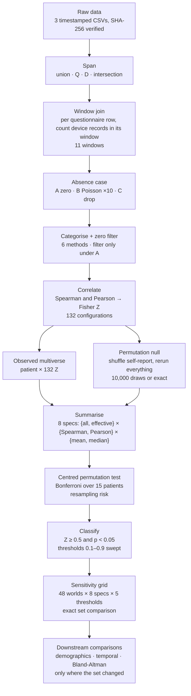

# AAMOS-00 concordance analysis, v2

Revision of *Characterization of Concordant Users of Smart Inhalers in Asthma* after the JMIR review.
Everything below runs from this repo on a laptop in about 90 minutes; no cloud compute.

**Headline.** Under the revised primary definition the concordant users are **702 and 917**.
Under the complete-case variant they are **294, 473 and 702**. Under Poisson imputation nobody clears the
threshold, although 294, 473 and 702 stay significant in every imputation.

---

## 1. New terms

The v1 analysis was one pipeline with one set of choices. v2 turns the choices that the reviewer and Kevin
questioned into explicit axes and runs every combination. These are the words used for that.

| Term | Meaning |
|---|---|
| **World** | One complete run of the pipeline under one *span* and one *absence case*. Named `span=<span>__case=<case>`. The v1 analysis is the world `span=union__case=A`. 48 worlds were run. |
| **Span** | The per-patient date interval inside which raw entries are believed. Entries outside it are removed from *both* the questionnaire and the device data before anything else happens. Four options, all derived from the records themselves: |
| · `union` | first entry of either source to last entry of either. Trims nothing. **This is v1.** |
| · `Q` | first to last questionnaire entry. Removes device records before the first / after the last questionnaire. |
| · `D` | first to last device record. Removes questionnaire entries outside the device's active period. Kevin's "more confident of true zero" variant (KT13). |
| · `intersection` | the overlap of Q and D. |
| **Absence case** | What a questionnaire window with **no device records** is taken to mean. The reviewer's point 4. |
| · `A` | zero puffs. **This is v1.** |
| · `B` | a device-side miss: replace the zero with a draw from Poisson(patient's puff rate × window hours). Ten independent draws give ten worlds (`k=00…09`). Zero-self-report windows are imputed too (KT8). |
| · `C` | unknown: drop the window from that configuration. Complete case. |
| **Configuration** | One of the 132 combinations of window (11), categorisation method (6) and zero filter (on/off) from the paper. Unchanged. |
| **Effective configurations** | Spearman uses ranks, and 4 of the 6 categorisation methods map values to the same ranks, so the 132 configurations are only **60 distinct analyses** under Spearman (30 under B and C, where the zero filter is off). The mean over 132 counted those 4 methods four times each. |
| **Summary spec** | How the per-configuration Z values are reduced to one number per patient: which configuration set (`all` = 132 or `effective` = 60), which correlation (Spearman or Pearson), which statistic (mean or median). All 8 are computed for every world. **Primary spec = effective / Spearman / mean.** |
| **Centred test** | The permutation p-value counts null draws at least as far from the **null's own mean** as the observed value is. v1 counted draws at least as far from **zero**. See §3. |
| **Exact enumeration** | For patients with few questionnaire rows, all distinct arrangements of the self-report are enumerated instead of sampled: 328 (136 arrangements), 454 (840), 917 (2,520), 398 (12,650). No Monte Carlo error for those four. |
| **Resampling risk** | For the sampled patients, the probability that the Bonferroni decision would differ under the exact p-value. Also reported: how many permutations a risk-bounded sequential rule (Gandy 2009) would have needed. |
| **Concordant** | Unchanged: observed Z ≥ 0.5 **and** Bonferroni-corrected p < 0.05 (α = 0.05/15). |

---

## 2. Pipeline



Stages up to **Correlate** are exactly v1's code, refactored into one package and pinned to verbatim copies of the
v1 implementation by 600 tests. The span and absence-case boxes are the two new axes. Everything from
**Summarise** on is post-processing over stored per-configuration Z values and can be recomputed in seconds.

| Stage | Assumptions worth knowing |
|---|---|
| Window join | Left join: rows come only from questionnaires. Device records on days with no questionnaire never enter any correlation (§5.5 counts them). Missing questionnaires are **excluded**, not zero (the v1 Methods text said zero; the code never did that). |
| Absence case | A patient whose span cannot be formed (e.g. no device records under `D`) drops out of that world rather than being analysed under a different span. |
| Categorise | Self-report codes are {0, 1, 3, 5, 9, 12}; nothing above 12 exists, so Table 2's ">12 puffs" column never applies. |
| Correlate | A perfect correlation (\|r\| = 1) is invalid and excluded, as v1 intended. |
| Permutation null | Shuffling reproduces v1's random draws index by index (same seed), so sampled results are comparable with the published null. |
| Classify | The threshold is on the raw observed Z, not on distance from the null. See open question 2. |

---

## 3. Why the null is not centred on zero

The zero filter drops rows where both signals are zero. After shuffling, a zero self-report that survives is
always paired with a positive device count, which manufactures a *negative* correlation. Null means reach
−0.67 (343), −0.55 (702), −0.50 (190). Under case C the mutual zeros are gone and the null sits at 0 for
everyone, which confirms the mechanism.

v1 asked "is |observed| larger than |null|", which mixes distance from the null with the null's own offset:
patient 190 sits 5 SD above its null yet had p = 0.77. The v1 figure already drew the band around the null's
centre; the code now tests the same way.

---

## 4. What changed from v1

| Change | Why | Effect on v1's numbers |
|---|---|---|
| Baseline named `union` | v1 trimmed nothing | none |
| Centred permutation test | §3 | 190, 343, 917 become Bonferroni-significant under the v1 configuration set |
| Ties count as exceedances | an exact patient's p must not depend on floating-point rounding | ≤ 1/(n+1) per patient |
| Perfect correlations excluded | scipy sometimes returns 1 − 1 ulp; v1 recorded Z ≈ 18 for **7,850 permutations** (398: 4,734; 328: 2,156; 454: 956; 917: 4) | null means for 398 and 328 were distorted; no significance flips |
| Primary summary over 60 effective configurations | the mean over 132 weighted 4 identical methods four times | 294 and 473 fall from 0.52 to 0.46 and 0.43 |
| Exact enumeration for small n | see §1 | no Monte Carlo error for 4 patients |
| Vectorised engine | the join does not depend on the shuffle, so it is computed once | 95 s per world locally |

---

## 5. Results

Assessed patients (15): 113, 190, 294, 328, 343, 398, 447, 454, 473, 514, 625, 701, 702, 917, 939.

### 5.1 Baseline world (`union`, case A), primary spec

| patient | Z (60 configs) | null mean | distance (null SD) | p Bonf | concordant |
|---|---|---|---|---|---|
| 702 | 0.69 | −0.55 | 10.9 | 0.001 | **yes** |
| 917 | 0.99 | −0.19 | 3.8 | 0.012 | **yes** |
| 294 | 0.46 | −0.01 | 11.4 | 0.001 | no, Z < 0.5 |
| 473 | 0.43 | −0.13 | 7.0 | 0.001 | no, Z < 0.5 |
| 190 | 0.35 | −0.50 | 5.1 | 0.001 | no, Z < 0.5 |
| 343 | −0.06 | −0.67 | 5.6 | 0.001 | no, Z < 0.5 |

Nine of 15 are Bonferroni-significant; the Z threshold does the selecting.
Median instead of mean: 190, 294, 702, 917. v1's configuration set (132) with the centred test: 294, 473, 702, 917.

### 5.2 Sensitivity grid, primary spec, threshold 0.5

| span | A (zero) | B (Poisson; concordant in k of 10) | C (drop) |
|---|---|---|---|
| union (v1) | 702, 917 | – (702: 2/10) | 294, 473, 702 |
| D | 702, 917 | – (702: 4/10) | 294, 473, 702 |
| Q | 702 | – | 294, 473, 702 |
| intersection | 702 | – | 294, 473, 702 |

- **The absence case dominates; the span barely matters.** 917 loses concordance only under Q and intersection,
  where the device records from day 0, the day before its first questionnaire, are trimmed: Z 0.99 → 0.77,
  p 0.012 → 0.06. Nobody else moves.
- **C:** null centred at 0 for everyone; 294 (0.53) and 473 (0.54) clear the threshold; 917 keeps only 20 valid
  configurations and is not significant.
- **B:** 294, 473 and 702 are significant in **10 of 10** imputations on every span, with means 0.40–0.51.
  B moves the threshold, not the evidence of association. 917 is never significant under B.

### 5.3 Threshold sweep (baseline, primary spec)

| threshold | 0.1 | 0.25 | 0.5 | 0.75 | 0.9 |
|---|---|---|---|---|---|
| concordant | 8 patients | 6 | 702, 917 | 917 | 917 |

### 5.4 Permutation count (KT1, KT2)

A Bonferroni decision at α = 0.0033 cannot be reached below ~300 draws. Every primary-spec decision in the A and C
worlds settles by **2,400** draws under the sequential rule (risk budget 10⁻³), with resampling risk < 10⁻⁶ at
10,000. Borderline decisions (risk up to 0.44) occur only in B worlds and in non-primary specs.

### 5.5 Missingness diagnostics (reviewer point 4, KT14)

- **Non-response is not hiding heavy use.** Device use is *lower* on days without a questionnaire for 14 of 15
  patients (significant for 4); non-response comes in blocks for 9 of 15. Median non-response rate 23 %.
- **Device-only days**, which never enter a correlation: 473 has 40 days / 99 puffs; 917 20 / 64; 939 24 / 70.
- **Mutual zeros** dominate 190 (144 of 163 rows), 343 (146 of 173), 702 (102 of 124). This is what the zero
  filter acts on and why those nulls sit far below zero.
- **Span D** cuts 190 to 19 rows, 454 to 2, 625 to 16, 701 to 30; it is unchanged for 294, 473, 917 and 939.

---

## 6. Paper updates

| # | Section | Change |
|---|---|---|
| 1 | Methods, multiverse | "132 configurations" → 132 specified, **60 distinct** under Spearman. Table 2: drop the ">12 puffs" column; the data-driven methods differ from the plain ones only for device counts |
| 2 | Methods, missing data | Missing questionnaires are excluded, not zero. Report §5.5 |
| 3 | Methods, test | Centred two-tailed test; report null mean and distance per patient; explain §3. Exact enumeration for 4 patients; sequential stopping at 2,400 |
| 4 | Methods, definition | One sentence: mean Z over the 60 effective configurations ≥ 0.5 and Bonferroni p < 0.05, span union, absence case A |
| 5 | Results | Headline 702 and 917; grid (§5.2); threshold table (§5.3); B as k of 10 |
| 6 | Sensitivity | Move into Methods and Results; it is the main analysis |
| 7 | Discussion | Exploratory framing; drop causal wording on Clinical Care Value; the feedback comparison now rests on n = 2 |
| 8 | Housekeeping | Fill the XX placeholders; hybrid thresholds are per patient, not across patients; remove unused Pearson outputs; cut or clarify the "Effect on concordance" column |

## 7. Reviewer replies, one line each

| Point | Reply |
|---|---|
| R1 small sample | Agreed; exploratory framing; headline set is 2 (3 under C) of 15 |
| R2 too many analyses | Multiverse reduced to its 60 distinct configurations; clustering and embedding classifier cut; grid reported as two marginals |
| R3 arbitrary threshold | Swept 0.1–0.9 (§5.3); mean and median both reported; stability shown per world |
| R4 absence = zero | Three absence cases on four spans (§5.2); non-response mechanism examined directly (§5.5) |
| R5 causality | Wording removed |
| R6 definition ambiguous | One sentence with every choice named (§6, row 4) |
| R7 sensitivity is post hoc | It is now the analysis (§6, row 6) |

Kevin's comments: KT1/2 → §5.4; KT3 → zero filter off under B and C; KT5 → §6 row 2; KT8 → implemented;
KT11/13 → span axis; KT14 → §5.5; KT16 → exact set comparison in the grid.

---

## 8. Reproduce

```bash
python -m aamos_concordance --verify                       # raw data matches the manifest
python scripts/build_world.py --world span=union__case=A   # one world, ~95 s
python scripts/sensitivity_grid.py                          # grid and marginals over built worlds
python scripts/missingness_diagnostics.py                   # §5.5
python run_all.py --changed-worlds --skip-sentiment         # downstream comparisons where the set changed
python -m pytest -q                                         # 601 tests, ~10 min
```

## 9. Where things are

| Path | Contents |
|---|---|
| `aamos_concordance/` | the pipeline: `spans`, `join`, `categorization`, `engine`, `summary`, `sensitivity`, `resampling` |
| `results/v1/` | frozen published results |
| `results/v2/worlds/<world>/` | `per_config_z.csv` (observed), `summary.csv`, `observed.csv`, `threshold_sweep.csv` |
| `results/v2/sensitivity/` | `grid.csv`, `world_stability.csv`, `case_b_stability.csv`, `threshold_curve.csv` |
| `results/v2/diagnostics/` | cell counts, non-response check, effective configurations |
| `results/v2/groups/concordant_sets.json` | every set per world and spec; `config.py` reads groups from here |
| `tests/oracles/` | verbatim v1 code; every refactor is pinned to it |

Every output has a `.provenance.json` sidecar with the git commit, data hashes and configuration.
